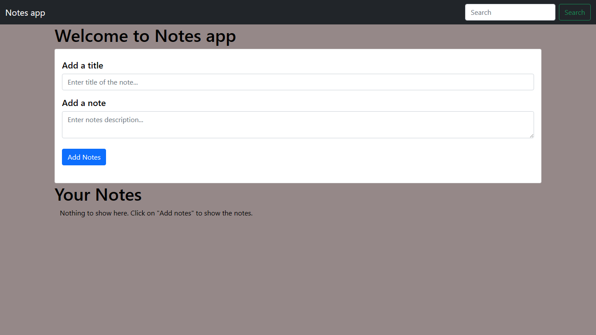

# Notes Taking App

Welcome to the Notes Taking App! This simple web application allows you to easily add, delete, search, and potentially edit notes. The app is built using the following technologies:

## Screenshots

## Features

### 1. Add a Note

- Enter the title and description of your note.
- Click the "Add Note" button to save your note.

### 2. Display Notes

- All your saved notes will be displayed on the page.

### 3. Delete a Note

- Click the "Delete Note" button to remove a note.

### 4. Search Notes

- Use the search bar to filter notes based on their content.

### 5. Local Storage

- Notes are stored locally, allowing you to access them even after refreshing the  page.

### 6. [Future Feature] Edit a Note

- Coming soon: Edit the title and description of an existing note.

## How to Contribute

Contributions are welcome! If you have ideas for improvements, bug fixes, or new features, feel free to open an issue or submit a pull request.

